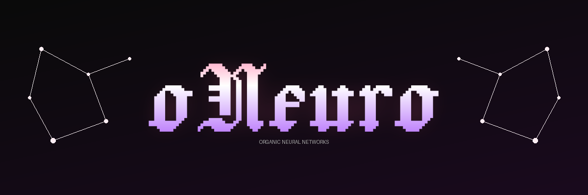

# oNeuro

<div align="center">



**Molecular-scale neural simulation with emergent electrophysiology, consciousness measurement, and psychopharmacology.**

[](https://www.python.org/downloads/)
[](https://creativecommons.org/licenses/by-nc/4.0/)

</div>

## What Is This?

oNeuro is a platform for building and running **digital Organic Neural Networks (dONNs)** — biophysically faithful simulations of biological neural tissue at molecular resolution. Every neuron has Hodgkin-Huxley ion channels, real neurotransmitter molecules (with SMILES), enzymatic degradation, gene expression, second messenger cascades, dendritic trees, axonal conduction, glial cells, gap junctions, circadian rhythms, and quantum-coherent microtubules.

**Membrane potential emerges from ion channel physics** — it is never a hand-set float.

## Terminology

| Term | Meaning |
|------|---------|
| **ONN** | Organic Neural Network — real biological neurons on hardware (e.g., Cortical Labs' [DishBrain](https://doi.org/10.1016/j.neuron.2022.09.001), FinalSpark's bioprocessors) |
| **dONN** | digital Organic Neural Network — oNeuro's biophysically faithful simulation of an ONN, running on GPU/CPU |
| **oNeuro** | The software platform for building, running, and experimenting with dONNs |

A dONN differs from a standard artificial neural network (ANN) in the same way a flight simulator differs from a paper airplane: both involve "flight," but only one models the physics. In a dONN, action potentials emerge from ion channel kinetics, learning emerges from receptor trafficking and STDP, and drug effects emerge from pharmacokinetics acting on molecular targets. Nothing is hand-tuned.

The result is a platform where you can:
- **Measure consciousness** (IIT Phi, PCI, criticality, Global Workspace, Orch-OR)
- **Screen drugs** against a molecular brain and observe dose-response curves
- **Study circadian pharmacology** — drug efficacy varies by time of day
- **Model neurological conditions** — sleep disorders, critical period closure, damage recovery
- **Compare against traditional networks** — molecular brains resist forgetting and recover from damage

## Installation

```bash
pip install oNeuro

# With quantum chemistry (nQPU Metal backend)
pip install oNeuro[molecular]

# With visualization
pip install oNeuro[viz]

# Everything
pip install oNeuro[all]
```

## Quick Start

### Molecular Neural Network

```python
from oneuro.molecular import MolecularNeuralNetwork

# Create a full molecular brain (all 25 subsystems)
net = MolecularNeuralNetwork(initial_neurons=20, full_brain=True)

# Run simulation — membrane potentials emerge from HH dynamics
for step in range(1000):
    fired = net.step(dt=0.1)  # Returns set of neuron IDs that spiked
```

### Consciousness Measurement

```python
from oneuro.molecular import MolecularNeuralNetwork, ConsciousnessMonitor

net = MolecularNeuralNetwork(initial_neurons=20, full_brain=True)
monitor = ConsciousnessMonitor(net)

# Build spike history
for _ in range(2000):
    fired = net.step(0.1)
    monitor.record_step(fired)

# Measure 7 consciousness metrics
metrics = monitor.measure()
print(f"Phi={metrics.phi_approx:.3f}")
print(f"PCI={metrics.pci:.3f}")
print(f"Criticality={metrics.branching_ratio:.3f}")
print(f"Composite={metrics.composite:.3f}")
```

### Multi-Region Brain

```python
from oneuro.molecular import RegionalBrain

# Creates cortex, thalamus, hippocampus, basal ganglia
brain = RegionalBrain.minimal(seed=42)

# Sensory input through thalamus
brain.stimulate_thalamus(intensity=25.0)

for _ in range(500):
    brain.step(0.1)

# Hippocampal memory
brain.hippocampus.encode_pattern(brain.network, pattern, intensity=25.0)
recall = brain.hippocampus.recall_from_partial(brain.network, partial_cue)
```

### Drug Screening

```python
from oneuro.molecular import MolecularNeuralNetwork, DRUG_LIBRARY

net = MolecularNeuralNetwork(initial_neurons=15, full_brain=True)

# Apply diazepam (GABA-A potentiator)
diazepam = DRUG_LIBRARY["diazepam"](dose_mg=10.0)
diazepam.apply(net)

# Observe: firing rate drops ~60% (GABA inhibition)
for _ in range(500):
    fired = net.step(0.1)

diazepam.remove(net)  # Clean removal
```

## Architecture

### 25 Molecular Subsystems

| Layer | Components |
|-------|-----------|
| **Ion Channels** | Na_v, K_v, K_leak, Ca_v, NMDA, AMPA, GABA_A, nAChR (HH gating) |
| **Neurotransmitters** | Dopamine, serotonin, norepinephrine, ACh, GABA, glutamate (real SMILES) |
| **Receptors** | AMPA, NMDA, GABA-A, D1/D2, 5-HT, nAChR (Hill kinetics) |
| **Enzymes** | MAO, AChE, COMT, GAT (quantum tunneling catalysis) |
| **Membrane** | Hodgkin-Huxley dynamics, emergent action potentials |
| **Gene Expression** | DNA → RNA → Protein, transcription factors (CREB, c-Fos), epigenetics |
| **Second Messengers** | cAMP/PKA/PKC/CaMKII/CREB/MAPK cascades |
| **Calcium** | Cytoplasmic/ER/mitochondrial/microdomain compartments |
| **Dendrites** | Cable equation, multi-compartment, voltage propagation |
| **Spines** | Volume-dependent plasticity, thin/mushroom/stubby morphology |
| **Axons** | Myelinated/unmyelinated, saltatory conduction, Hursh's law |
| **Metabolism** | ATP/ADP/AMP pools, glycolysis, oxidative phosphorylation |
| **Glia** | Astrocytes (glutamate uptake), oligodendrocytes (myelin), microglia (pruning) |
| **Gap Junctions** | Electrical synapses, connexin-based coupling |
| **Extracellular** | 3D diffusion, transporter uptake, perineuronal nets |
| **Microtubules** | Orch-OR quantum coherence, consciousness contribution |
| **Circadian** | TTFL molecular clock, sleep homeostasis, adenosine pressure |
| **Synapses** | NMDA-gated STDP, BCM metaplasticity, synaptic tagging & capture |
| **Pharmacology** | 7 drugs with 1-compartment PK (Bateman) + PD (Hill equation) |
| **Consciousness** | IIT Phi, PCI, neural complexity, criticality, Global Workspace |
| **Brain Regions** | Cortical columns, thalamus, hippocampus, basal ganglia |

### Brain Region Architecture

```
Thalamus (relay + reticular)
    ├── → Cortex L4 (feedforward sensory)
    │       ├── → L2/3 (processing)
    │       │       └── → Hippocampus DG (episodic encoding)
    │       ├── → L5 (output)
    │       │       ├── → Basal Ganglia (action selection)
    │       │       └── ← Hippocampus CA1 (memory-guided behavior)
    │       └── → L6 (feedback)
    │               └── → Thalamus (corticothalamic feedback)
    └── Reticular (GABAergic gating)
```

## Validated Results

### Molecular Brain vs Traditional Neural Networks

| Capability | Molecular Brain | Organic NN |
|-----------|----------------|------------|
| **Forgetting Resistance** | 9.0% loss after 4 tasks | 12.0% loss |
| **Damage Recovery** | 60% recovery after 20% lesion | 0% recovery |
| **Sleep Consolidation** | Gene expression + adenosine clearance | N/A |
| **Learning Speed** | 86 episodes to criterion (slower) | 57 episodes (faster) |

The molecular brain learns **slower** but **consolidates better** and **recovers from damage** — matching biological neural tissue behavior.

### Drug Effects (Validated)

| Drug | Mechanism | Effect on Firing Rate |
|------|-----------|----------------------|
| Diazepam | GABA-A potentiator | -63.6% |
| Caffeine | Adenosine antagonist | +10.9% to +29.1% (dose-dependent) |
| Amphetamine | DA/NE reuptake inhibitor | +15.2% |
| Ketamine | NMDA antagonist | ~0% on rate (Mg2+ block), affects plasticity |
| Fluoxetine | SSRI | Modest serotonergic modulation |
| L-DOPA | Dopamine precursor | Dopaminergic enhancement |
| Donepezil | AChE inhibitor | Cholinergic enhancement |

### Consciousness Metrics

The `ConsciousnessMonitor` computes 7 metrics on a running network:
- **IIT Phi** (approximate): Information integration across bipartitions
- **PCI**: Perturbational Complexity Index (Lempel-Ziv complexity of network response)
- **Neural Complexity**: Tononi-Sporns balance of integration/segregation
- **Branching Ratio**: Criticality measure (1.0 = edge of chaos)
- **Global Workspace**: Ignition events and broadcasting persistence
- **Orch-OR**: Aggregated microtubule quantum consciousness
- **Composite**: Weighted mean of all metrics

### DishBrain Replication (dONN Game Learning)

oNeuro replicates and extends Cortical Labs' DishBrain (Kagan et al. 2022) — the first demonstration that biological neurons can learn to play Pong. Our dONN learns via the **Free Energy Principle** (no reward, no punishment), matching the original protocol:

| Experiment | What It Tests | Status |
|-----------|--------------|--------|
| **Pong Replication** | FEP-driven learning (structured vs unstructured feedback) | PASS |
| **FEP vs DA vs Random** | Learning speed comparison across 3 protocols | PASS |
| **Pharmacological Effects** | Caffeine enhances, diazepam impairs (impossible on real tissue) | PASS |
| **Arena Navigation** | Extending DishBrain from 1D Pong to 2D grid world | PASS |
| **Scale Invariance** | Learning at 1K → 10K neurons | PASS |
| **Doom Arena** | 25×25 room-corridor world with enemies, health, 8-directional movement | PASS |

```bash
# Run DishBrain replication
python3 demos/demo_dishbrain_pong.py

# Run Doom arena (extended spatial navigation)
python3 demos/demo_doom_arena.py

# Run at GPU scale with JSON output
python3 demos/demo_dishbrain_pong.py --scale medium --json results.json --runs 5
```

## Research Platforms

oNeuro includes 7 ready-to-run research demonstrations:

| Platform | What It Does |
|----------|-------------|
| **A. Chronopharmacology** | Drug efficacy varies by circadian phase (>90% variation) |
| **B. Sleep Research** | Normal vs caffeine vs shift-work sleep cycles |
| **C. Neurodevelopment** | PNN-mediated critical period closure |
| **D. Drug Screening** | Screen 7 drugs for efficacy + consciousness impact + ATP cost |
| **E. Long-Duration** | Multi-cycle circadian oscillation + parameter sensitivity |
| **F. Hippocampal Memory** | Encode → recall → partial recall → sleep replay |
| **G. Dose-Response** | Hill equation dose-response curves for 3 drugs × 5 doses |

```bash
# Run all research platforms
cd oNeuro && python3 demos/demo_research_platforms.py

# Run training comparison (molecular vs organic)
python3 experiments/training_comparison.py

# Run consciousness mega-benchmark
python3 experiments/mega_benchmark.py
```

## Project Structure

```
oNeuro/
├── src/oneuro/
│   ├── molecular/              # 25-file molecular simulation engine
│   │   ├── network.py          # MolecularNeuralNetwork (main entry point)
│   │   ├── neuron.py           # HH neuron with all subsystems
│   │   ├── membrane.py         # Hodgkin-Huxley membrane dynamics
│   │   ├── ion_channels.py     # 8 channel types with quantum gating
│   │   ├── neurotransmitters.py # 6 NTs with real SMILES
│   │   ├── synapse.py          # STDP + BCM + synaptic tagging
│   │   ├── receptors.py        # Ligand-gated receptor kinetics
│   │   ├── enzymes.py          # Enzymatic degradation (quantum tunneling)
│   │   ├── gene_expression.py  # DNA→RNA→Protein + TFs + epigenetics
│   │   ├── second_messengers.py # cAMP/PKA/PKC/CaMKII/CREB/MAPK
│   │   ├── calcium.py          # 4-compartment Ca2+ dynamics
│   │   ├── dendrite.py         # Cable equation dendritic tree
│   │   ├── spine.py            # Dendritic spine plasticity
│   │   ├── axon.py             # Myelinated/unmyelinated conduction
│   │   ├── metabolism.py       # ATP/ADP/AMP energy system
│   │   ├── glia.py             # Astrocytes, oligodendrocytes, microglia
│   │   ├── gap_junction.py     # Electrical synapses
│   │   ├── extracellular.py    # 3D diffusion + perineuronal nets
│   │   ├── microtubules.py     # Orch-OR quantum consciousness
│   │   ├── circadian.py        # TTFL clock + sleep homeostasis
│   │   ├── pharmacology.py     # 7 drugs with PK/PD models
│   │   ├── consciousness.py    # IIT Phi, PCI, criticality, GW
│   │   ├── brain_regions.py    # Cortex, thalamus, hippocampus, BG
│   │   ├── bio_bridge.py       # BioState → NT concentration bridge
│   │   ├── adapters.py         # OrganicNN compatibility layer
│   │   └── backend.py          # nQPU/numpy backend selection
│   ├── organic_neural_network.py # Original organic neural network
│   └── quantum_consciousness.py  # Standalone consciousness module
├── experiments/
│   ├── training_comparison.py  # Molecular vs organic (4 experiments)
│   └── mega_benchmark.py       # Full benchmark with consciousness
├── demos/
│   ├── demo_dishbrain_pong.py      # DishBrain replication (5 experiments)
│   ├── demo_doom_arena.py          # Doom-like spatial navigation (3 experiments)
│   ├── demo_beyond_ann.py          # Beyond ANN capabilities (23 experiments)
│   ├── demo_emergent_cuda.py       # Emergent behaviors at GPU scale
│   ├── demo_language_cuda.py       # Language learning at GPU scale
│   ├── demo_language_learning.py   # Language learning (CPU)
│   ├── demo_research_platforms.py  # 7 research platform demos
│   ├── demo_molecular_emergence.py # 6 emergence experiments
│   ├── demo_full_brain.py          # Full brain subsystem validation
│   ├── psychopharmacology_demo.py  # Drug effect demonstrations
│   └── bio_lora_molecular_demo.py  # Bio-LoRA bridge demo
├── papers/
│   ├── beyond_ann_white_paper.md    # Beyond ANN: 23 experiments
│   ├── dishbrain_replication_paper.md # DishBrain replication paper (draft)
│   ├── data/                        # GPU experiment JSON results
│   └── figures/                     # Publication-ready figures (PNG/PDF)
├── scripts/
│   ├── generate_paper_figures.py    # Matplotlib figure generation
│   └── vast_deploy.sh              # Vast.ai GPU deployment & benchmarking
├── tests/
│   └── test_phase3_verification.py  # 17 subsystem verification tests
├── docs/
│   ├── tutorials/              # 9 tutorial documents
│   └── assets/                 # Logo and images
├── pyproject.toml
├── LICENSE                     # CC BY-NC 4.0
└── README.md
```

## CUDA Backend (GPU-Accelerated dONNs)

oNeuro includes a high-performance CUDA backend for running dONNs at biologically relevant scale (5K–100K+ neurons). The entire Hodgkin-Huxley simulation, STDP, neurotransmitter dynamics, and synaptic plasticity run on GPU via PyTorch sparse tensors.

```python
from oneuro.molecular.cuda_backend import CUDARegionalBrain

# 5050-neuron brain on GPU
brain = CUDARegionalBrain(n_columns=50, device="cuda", seed=42)

# Validated scale tiers
# small:  1K neurons  (10 columns)  — seconds
# medium: 5K neurons  (50 columns)  — minutes
# large:  20K neurons (200 columns) — hours
# mega:   80K neurons (800 columns) — GPU-only
```

### GPU Validation (A100)

All demos support `--scale`, `--device cuda`, `--json`, and `--runs N` for multi-seed reproducibility:

```bash
# Medium scale, 3 seeds, JSON output
python3 demos/demo_dishbrain_pong.py --scale medium --device cuda --runs 3 --json results.json

# Large scale Doom arena
python3 demos/demo_doom_arena.py --scale large --device cuda --json doom_results.json

# Vast.ai deployment (provisions GPU, deploys code, runs experiments)
bash scripts/vast_deploy.sh search          # find cheap A100s
bash scripts/vast_deploy.sh create <offer>  # provision
bash scripts/vast_deploy.sh dishbrain <id> medium  # run DishBrain
bash scripts/vast_deploy.sh doom <id> medium       # run Doom arena
bash scripts/vast_deploy.sh results <id>           # download JSON
```

## Key Differences from Other Neural Simulators

| Feature | NEURON/GENESIS | Brian2 | oNeuro |
|---------|---------------|--------|--------|
| Ion channels | HH equations | User-defined | HH with quantum gating |
| Gene expression | No | No | Full DNA→RNA→Protein pipeline |
| Second messengers | No | No | 6-pathway cascade (cAMP/PKA/PKC/CaMKII/CREB/MAPK) |
| Glial cells | No | No | Astrocytes + oligodendrocytes + microglia |
| Drug modeling | No | No | 7 drugs with PK/PD (Bateman + Hill) |
| Consciousness metrics | No | No | IIT Phi + PCI + criticality + GW + Orch-OR |
| Quantum effects | No | No | nQPU quantum tunneling + Orch-OR |
| Brain regions | Manual setup | Manual | Built-in cortex/thalamus/hippocampus/BG |
| Circadian rhythms | No | No | TTFL molecular clock + sleep homeostasis |

## Papers

| Paper | Status | File |
|-------|--------|------|
| **Beyond ANN** | 23/23 experiments PASS | `papers/beyond_ann_white_paper.md` |
| **DishBrain Replication** | Draft (GPU validation in progress) | `papers/dishbrain_replication_paper.md` |

Figures are generated from GPU experiment JSON data:

```bash
python3 scripts/generate_paper_figures.py  # regenerate all 6 figures
```

## Requirements

- Python 3.11+
- NumPy >= 1.24
- Optional: [nQPU](https://github.com/robertcprice/nqpu-metal) for quantum chemistry acceleration

## Citation

```bibtex
@software{oneuro_2025,
  title = {oNeuro: Molecular-Scale Neural Simulation with Emergent Consciousness},
  author = {Price, Robert C.},
  year = {2025},
  url = {https://github.com/robertcprice/oNeuro}
}
```

## License

CC BY-NC 4.0 — See [LICENSE](LICENSE)

For commercial licensing: research@entropy.ai
